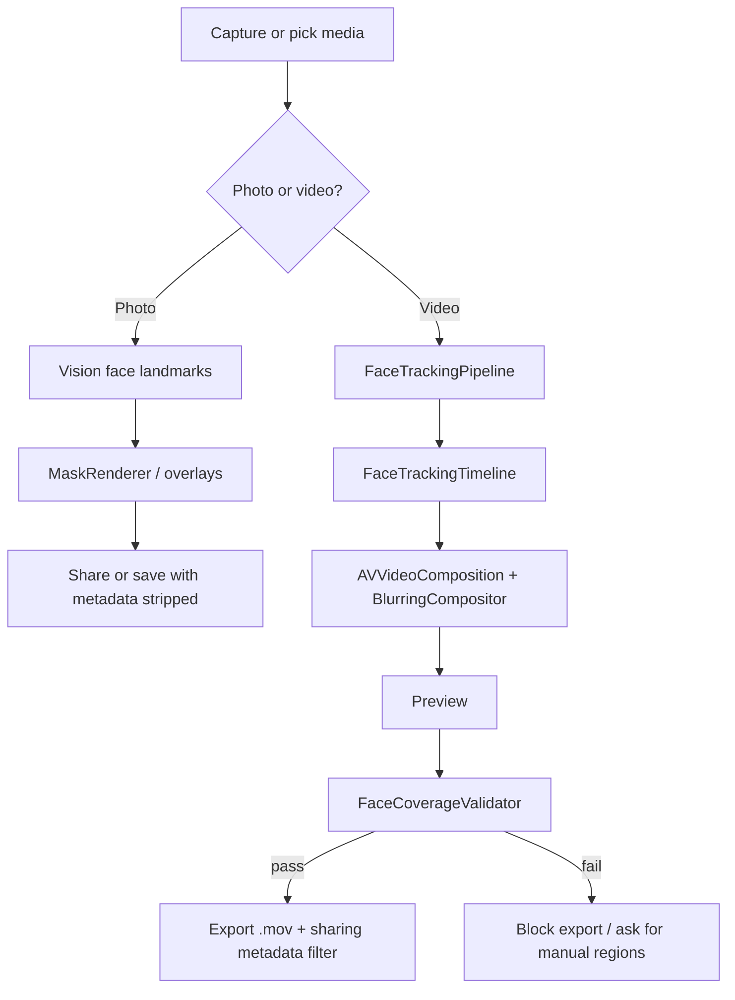

I built Safe Faces for one reason: parents should be able to post online without that little pause before they hit share.

Birthday party. First day of school. Team photo. The moment is good — then you start scanning faces that aren’t yours. Should this really go on Instagram, Facebook, the school page, the team account?

That’s the product. Not “stop posting.” Not a lecture. Just: cover the faces you don’t want public, keep the ones you do, and post with confidence.

This post is the deeper build story — for other engineers and teams who care about privacy products that actually ship. What I built, why the architecture looks the way it does, how we’re testing it, how I routed different models at different jobs and wrote prompts as product law, and what I’d still change.

**Here for the AI workflow?** Jump to [Cursor, Xcode MCP, and model routing](#how-i-actually-built-it-cursor-xcode-mcp-and-model-routing) — the loop, the model routing table, and prompting as specification.

> Post the memory. Not their face.

---

## The problem (and the audience)

Most privacy tools talk to developers or security people. Safe Faces talks to parents, teachers, coaches, and youth orgs.

Their mental model is simple:

1. I have a photo or video I want to post
2. Some faces in it shouldn’t be identifiable
3. I don’t want to learn After Effects
4. I definitely don’t want to upload the file to a stranger’s server “for processing”

That last point is non-negotiable. If the pitch is “protect kids,” and the architecture is “send the birthday video to our cloud,” you’ve already lost the trust argument. Even if your backend is perfect. Parents don’t evaluate SOC 2 reports at 10pm. They evaluate: does this leave my phone?

So the constraint became the product:

- **All detection, tracking, and blurring on-device**
- **No account**
- **No analytics SDK**
- **No third-party code hanging off the side**
- **Safe by default** — every face starts covered; you opt faces *in* to being visible

That’s harder than a web blur demo. It’s also the only version of this that feels honest.

---

## What Safe Faces is today

**Safe Faces** (Xcode project still named `blurrdFaces`) is an iPhone + iPad app targeting iOS 18.5+.

Current capabilities:

| Surface | What you get |
|--------|----------------|
| Photos | Auto face detect, tap to toggle, manual blur regions, style options (mosaic, gaussian, black bar, emoji, shapes), intensity control |
| Videos | Full-clip face tracking, tap to toggle, blur all / unblur all, mosaic export, manual regions |
| Camera | In-app photo + video capture (zoom, torch, grid, timer, up to 4K) |
| Export | Metadata stripped; video export can be **blocked** if coverage looks unsafe |
| Trust | On-device only — nothing uploaded |

Landing page lives at [safefaces.xyz](https://www.safefaces.xyz/) and points straight at TestFlight. The product is the phone. The site is how people find it.

Open beta: [TestFlight join link](https://testflight.apple.com/join/Uv7xJrkp)

---

## Product principles (these drove the engineering)

Before the stack, these rules:

### 1. Safe by default
Empty “visible faces” set means blur everyone. Parents should never have to remember to turn protection on.

### 2. Fail closed, not open
A soft miss that exports anyway is worse than a hard error. If the system isn’t sure a face is covered for video export, stop and tell the user.

### 3. Don’t shame the sharing
Marketing and UX treat posting as normal. The tool removes worry. It doesn’t scold.

### 4. Under-claim the tech
Never promise “100% detection.” Promise contracts you can enforce: on-device, metadata stripped, export refused when coverage fails.

### 5. Don’t brand the defense as “AI”
When parents are worried about public images getting scraped into systems they can’t control, calling *your* product “AI-powered” muddies the story. We use Apple’s on-device Vision frameworks. Local chip. No model we train on their kids. That distinction matters in copy as much as in architecture.

---

## Architecture overview

High-level flow:



### Stack (intentionally boring)

| Layer | Choice | Why |
|------|--------|-----|
| UI | SwiftUI | Fast iteration, matches modern iOS |
| Detection / tracking | Vision | On-device, no custom model ops burden for v1 |
| Video | AVFoundation + custom `AVVideoCompositing` | Frame-accurate blur during preview and export |
| Effects | Core Image | Masked blur / mosaic / overlays |
| Photos | Photos / PhotosUI | Import + save |
| Dependencies | **None** | Trust surface stays tiny |

No Firebase. No analytics. No “just one SDK.” For a privacy product, dependency count is a security claim.

Landing / marketing: Next.js + Tailwind in a **separate private repo**, domain on Vercel (`safefaces.xyz`). iOS source stays off public GitHub.

---

## The hard part: video, not photos

Photos are a solved-ish problem. One frame. Detect. Mask. Done.

Video is where privacy products die.

Kids don’t hold still. Hands cross faces. People turn in profile. Cameras pan. Faces enter mid-clip. Trackers drift onto walls. Identity flips and suddenly you’re blurring the wrong person — or worse, leaving someone uncovered for three frames at the start.

So the video system isn’t “run face detection once.” It’s a pipeline with explicit privacy-oriented behavior:

### Tracking goals

- Lock faces early so opening frames aren’t exposed
- Keep identity stable across time (same person = same ID)
- Survive brief occlusions without inventing ghost boxes on the background
- Expand boxes enough to cover whole heads, not just tight face rectangles
- Give the compositor and the UI the **same** answer for “who is blurred at time T”

That last one sounds obvious. It’s where bugs hide. If overlays say face A is covered but export renders face A clear, you’ve shipped a lie. So playback overlays, blur decisions, and pre-export validation all resolve faces through the same timeline / resolver path.

### Composition

Preview and export go through a custom video compositor (`BlurringCompositor`) that applies masks per frame using Core Image, driven by the tracking timeline. Parents see what they’ll get before they share — and export isn’t a second, looser code path.

### The export gate

This is the piece I’m proudest of as a product engineer.

Before a video finishes exporting, `FaceCoverageValidator` walks the timeline on the same sampling grid the tracker uses. If coverage drops below a hard threshold (we require effectively full coverage — on the order of **99.5%** of frames, with **zero** uncovered frames allowed in the failure path), export throws and surfaces a clear message: review the clip, add manual blur regions if needed.

```swift
// Idea, not the whole module: fail closed before you hand someone a leak.
struct FaceCoverageValidator {
    var minimumCoverageRatio: Double = 0.995

    func validateOrThrow(...) throws {
        let result = validate(...)
        guard result.passed else {
            throw CoverageValidationError.insufficientCoverage(
                ratio: result.coverageRatio,
                uncoveredFrames: result.uncoveredFrameCount
            )
        }
    }
}
```

I’d rather a parent see an error than a green checkmark on an unsafe file. Privacy UX is about **what you refuse to ship**, not just what you blur.

---

## Photos, camera, and the interaction model

Photo flow is the teaching surface for the whole app:

- Faces detected on load
- **Blue outline = covered**
- **Red outline = exposed** (user deliberately uncovered it)
- Tap empty space to add a manual region when detection misses
- Side panel for blur / emoji / shape styles

Video reuses that language. Same colors. Same tap semantics. Batch “blur all / unblur all” for group chaos.

The in-app camera exists so the workflow isn’t “leave app → Photos → come back.” Capture and protect in one place. 4K, zoom, torch, grid, timer — enough to feel serious without turning into a camera company.

Metadata stripping on export/share isn’t a settings toggle parents forget. It’s the default path. GPS and device fingerprints shouldn’t ride along for free on a “privacy” export.

---

## How we’re testing (contracts, not vibes)

Privacy software that only “feels fine” on your desk will fail on a soccer field.

### Layer 1 — Automated contracts

Swift Testing suites around the face timeline / resolver:

- Blur **everyone** when no faces are marked visible
- Respect uncovered (visible) face IDs
- Manual regions always stay in the blur set
- Interpolate boxes between samples without inventing faces across big absence gaps
- Overlay set matches blur set at the same timestamp

```swift
@Test("facesToBlur blurs all when no faces are marked visible")
func blurAllByDefault() {
    let toBlur = timeline.facesToBlur(visibleFaceIDs: [], at: time)
    #expect(toBlur.count == 1)
}
```

These aren’t glamorous. They’re the difference between a demo and a product parents can trust.

### Layer 2 — Export validation

The coverage gate is both product logic and a testable contract: same resolver as playback, same time grid, fail closed.

### Layer 3 — TestFlight reality

Open beta on real devices. What I’m watching for:

- Birthday / team / classroom group photos
- Kids running, turning, hands over faces
- “Blur everyone except mine”
- Missed faces, ghost blurs, portrait orientation weirdness
- Trust friction: “did anything upload?”

Unit tests catch logic. Testers catch childhood chaos.

If you’re building something similar: instrument the failures parents report. “Missed the kid in the red hoodie at 0:12” is worth more than a generic 5-star.

---

## Brand and marketing as engineering constraints

I treated brand like part of the system design.

- Warm cream UI, rounded type — family product, not security cosplay
- Landing page and app share the same tokens
- Copy avoids shaming parents
- We don’t market unfinished features as shipped (video styles still mosaic-first; stickers aren’t real yet)
- Site CTA is TestFlight, not a fake web app

There’s a full brand guideline PDF for consistency, including an accessibility rule we learned the hard way: bright brand blue is a great **fill** and a bad **text** color on cream. Deep blue for type, bright blue for buttons. Same hue family, different jobs.

For companies reading this: if your privacy product looks like a SOC dashboard, parents bounce. If your landing page overclaims detection accuracy, engineers bounce. Honesty scales better than hype.

---

## How I actually built it: Cursor, Xcode MCP, and model routing

I didn’t build Safe Faces by babysitting Xcode all day and hand-typing every compositor frame.

I built it in Cursor with Xcode still in the loop — via **Xcode MCP** — and I treated models like tools with different jobs, not one magic coworker that “does the app.”

That distinction matters. AI can ship a demo fast. A privacy product for kids still needs you in the driver’s seat.

### The loop

My day-to-day looked like this:

1. **Think in Cursor** — product rules, architecture, file structure, “what must never fail”
2. **Implement in Cursor** — SwiftUI screens, Vision/AVFoundation pipeline, tests, landing page
3. **Build / run / inspect through Xcode MCP** — don’t break flow by constant app-switching
4. **Verify on device / TestFlight** — soccer field footage doesn’t care about your prompt
5. **Feed the failure back into Cursor** — “missed face at 0:12,” not “make tracking better”

Cursor is where the system lives. Xcode is still the source of truth for compile, run, and Apple platform reality. MCP is the bridge so I’m not copy-pasting between two brains.

Been using Cursor + Xcode MCP on this. So easy. So fun. Also: still not autopilot.

### Why Xcode MCP mattered

iOS work has a tax: you write in one place, then jump to Xcode to build, run, dig through logs, poke at the project.

With Xcode MCP, that tax got lower. I could stay in the agent conversation and still ask for the things that used to force a context switch:

- build the project
- run on a simulator / device path
- inspect what Xcode actually sees
- chase compile and runtime issues without losing the thread of the change

For Safe Faces, that mattered most on the hard files — `FaceTrackingPipeline`, `BlurringCompositor`, `FaceCoverageValidator`. Those aren’t “generate a view” tasks. They’re “change this, build, watch it fail, tighten the contract, build again” tasks. Keeping Cursor and Xcode connected made that loop tighter.

The win isn’t “I never open Xcode.” The win is: Xcode stops being a wall and starts being a tool the agent can talk to.

### Different models for different jobs

I don’t use one model for everything. That’s how you get confident garbage.

Rough routing that worked for me:

| Job | What I want from the model | Why |
|-----|----------------------------|-----|
| Product / architecture | Strong reasoning, slow down, challenge assumptions | Defaults, fail-closed export, on-device constraints |
| Swift systems work | Careful edits, respect existing types, don’t invent APIs | Vision + AVFoundation hate vibes |
| UI / brand / landing | Taste + consistency with the design system | Cream/blue language, parent tone, no AI hype copy |
| Tests / contracts | Pedantic, literal, edge-case hungry | Blur-by-default and resolver parity are law |
| Quick refactors / glue | Fast model, small scope | Rename, wire a button, move a helper |
| Review / “did we lie?” | Skeptical second pass | Marketing claims vs what the code actually enforces |

The pattern: **plan with a deep model, implement with a focused one, verify with the pedantic one, then prove it in Xcode.**

When I let one chat do “design the privacy model + rewrite the compositor + write the landing hero,” quality dropped. When I split the work — “first lock the contract, then implement against it, then build” — the app got sharper.

### What I prompted for (and what I didn’t)

The product principles above weren’t just docs for me. They were the prompts. Good asks on this project sounded like product law:

- “Empty visible set means blur everyone. Don’t change that.”
- “Preview overlays and export must use the same resolver.”
- “If coverage fails, refuse export. Don’t soften this into a warning.”
- “No third-party SDKs. No analytics. On-device only.”

Bad prompts (that I learned to stop writing):

- “Make tracking smarter”
- “Add AI features”
- “Just make export work”
- “Improve the UI”

Vague asks get vague architecture. Specific contracts get shippable code.

### Where AI helped most

**1. Moving across the whole stack in one workspace**
Brand guidelines, SwiftUI, video pipeline, Next.js landing, TestFlight funnel — same product brain. I wasn’t waiting on a handoff between “design person,” “iOS person,” and “web person.” That was me + Cursor, iterating in public with myself.

**2. Keeping the privacy story honest**
I’d ask a model to compare landing copy against actual behavior. If the site said something the validator didn’t enforce, we fixed the copy or the code. Usually the code.

**3. Tests as a forcing function**
Having the agent write and extend the Swift Testing contracts from the testing section made the “safe by default” rule harder to accidentally break later. The model is great at being annoying in a useful way: “what happens if `visibleFaceIDs` is empty?”

**4. Speed without abandoning taste**
The camera screen, editor chrome, side nav, brand refresh — those went faster because I could design and implement in the same session. I still made the calls on warmth vs tech-bro privacy cosplay.

### Where I still had to be the adult

AI will happily generate a beautiful path that uploads the video “just for processing.”

Hard no.

AI will also paper over a flaky tracker with “best effort” export.

Also no.

Every refusal in this post — media never leaves the device, blur everyone by default, fail closed on bad coverage, don’t market unfinished overlays as shipped, don’t call the product “AI-powered” when parents are already anxious about scraping — is a human decision. Models accelerate the build. They do not own the product principles.

### A realistic picture (not the LinkedIn version)

Some days Cursor + Xcode MCP felt unfair — in a good way. Scaffold a screen, wire Vision, generate tests, bounce a build error, fix it, keep going.

Other days the video pipeline reminded me I’m still writing a real AVFoundation app. Drift, occlusion, orientation, identity flips. You can prompt forever. Eventually you need a clip of kids running around and a cold look at the timeline.

So the workflow isn’t “vibe code an App Store app.” It’s:

> Use Cursor to move fast. Use different models on purpose. Use Xcode MCP to stay honest with the compiler. Use TestFlight to stay honest with parents.

That’s how Safe Faces got from idea → brand → app → landing → open beta without pretending the hard parts were free.

---

## What’s hard / what’s next

Still beta. It will miss on weird clips. That’s expected.

Near-term:

1. **Video blur style parity** with photos
2. Finish Settings / sticker stubs honestly — no fake “done”
3. Harden crowded scenes, tiny faces, heavy occlusion
4. Keep TestFlight feedback flowing into tracking config and validator behavior
5. App Store once export reliability feels boring
6. Landing polish on [safefaces.xyz](https://www.safefaces.xyz/) (contact, OG image, sharper CTA copy)

I’m deliberately not rushing “smart AI suggestions.” The positioning is control and local processing. Feature gravity should pull toward reliability and clarity, not novelty.

---

## Decisions I’d defend in a design review

**On-device only.** Trust is the product. Cloud processing is a different company.

**No third-party SDKs.** Every dependency is a privacy footnote you have to explain.

**Custom compositor path for video.** Parents must preview the truth they’ll export.

**Shared resolver for UI + blur + validation.** One source of “who is covered at T.”

**Fail-closed export.** Prefer friction over silent leaks.

**Safe defaults.** Opt faces into visibility, never into protection.

**Separate private web repo.** Proprietary iOS stays closed; marketing still ships.

**AI-assisted, human-owned.** Cursor and Xcode MCP set the pace. The contracts and refusals are mine.

---

## What this proves (for other builders / teams)

If you’re evaluating this as a case study:

- I can take a real consumer privacy problem and ship a constrained native architecture that matches the pitch
- I care about product contracts (defaults, fail-closed behavior), not just feature lists
- I’m comfortable in SwiftUI + Vision + AVFoundation systems work, not only frontend web
- I can also ship the go-to-market surface (landing, brand, TestFlight loop) without waiting on a committee
- I work AI-native without outsourcing judgment: Cursor and Xcode MCP for velocity, deliberate model routing per job, human-owned privacy contracts
- I’m honest about beta limits — which is how you earn trust with both users and technical readers

If your team is building something in child safety, education media, or on-device computer vision — I’m interested in hard problems with clear ethics and sharper engineering constraints. That’s the fun stuff.

---

## Takeaways

- Privacy UX is mostly about **defaults** and **refusals**, not blur radius sliders
- Video identity + continuity is the actual product risk; photos are the easy mode
- Keep playback, export, and validation on the same decision path
- Don’t upload kids’ media to prove you care about kids’ media
- TestFlight on messy real footage beats another week of happy-path demos
- Marketing should under-claim; architecture should over-deliver on the contracts you publish
- Route models by job and keep the compiler in the loop; agents move fast, they don’t own your ethics

---

## Closing

Safe Faces exists so posting can feel normal again — for parents, teachers, coaches, anyone posting groups of kids without twenty permission slips.

It’s on-device. It’s fail-closed where it counts. It’s still early.

Try the beta. Break it on real footage. Tell me where a face slipped.

This is an ongoing passion project. I'll keep writing as I go — different parts, real user testing, and what it's like growing the app through social media. Stay tuned.

[safefaces.xyz](https://www.safefaces.xyz/) · [TestFlight](https://testflight.apple.com/join/Uv7xJrkp)

Post the memory. Not their face.
