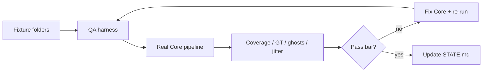
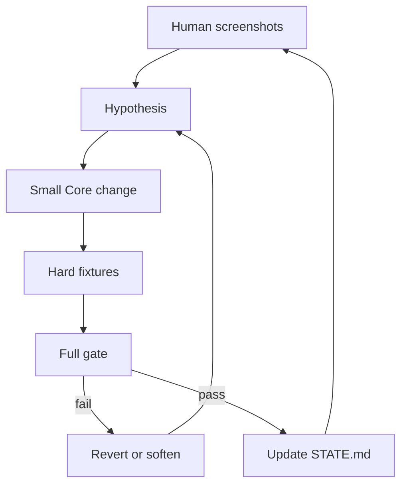

Week one of shipping Safe Faces wasn’t a “fix a button” week.

I’m documenting the road from start to finish — getting this app live and to the first 100 users. Week zero was the intro. Week one was the part most build-in-public posts skip: **quality infrastructure**. Teach the system what “good” looks like. Measure it. Refuse to ship vibes.

I filmed a full screen-share of this same week. Watch that for the walkthrough. This post is the written version — with more depth on the decisions I’d make the same way on a team: fail closed, lock what works, and don’t let agents (or ego) thrash architecture that already earned its keep.

> Post the memory. Not their face.

---

## Quick recap

**What shipped**
- A fixture corpus (real videos/photos in scenario folders)
- A **gate** — automatic pass/fail against the *same* tracking pipeline the app ships
- Cursor + Xcode MCP so agents can reach source, simulator, and logs without me living in Xcode
- Smoother video preview (architecture lock: bake blur, don’t live-composite)
- `qa/STATE.md` — resume memory so the loop doesn’t restart from vibes every chat

**What’s still on the board (honest)**
- Ghost blurs on jeans / laps
- Boxes floating on walls/chalkboards after a pan
- Overlaps and wrong “faces in frame” counts
- Green metrics that still lose to human eyes sometimes

That tension is the point of week one. I built a grader. Then I used my eyes to make the grader better — not to pretend the grader was already perfect.

---

## Why a QA loop (and why this matters beyond the app)

I work a nine-to-five. I can’t sit in Cursor responding every two seconds while an agent “tries something.”

Face blur on real parent video is trial and error: crowds, pans, occlusion, orientation, tiny faces. If you don’t validate, log, and resume, you burn evenings and ship confidence you didn’t earn.

Week one’s goals were simple:

1. **Validate** — did this change actually work on hard clips?
2. **Log** — what failed, what already works, what must not regress
3. **Hand off** — agents run longer stretches; I review receipts, not every micro-prompt

That’s not “AI hype.” That’s how you ship a privacy feature when a soft miss is worse than friction. Parents don’t care that your demo looked clean once. They care that the birthday video doesn’t leak a face.

---

## Stack: constraints first

Not a lot of tools. That’s intentional.

| Piece | Role |
|--------|------|
| **Xcode** | Required for native iOS. I don’t love living in it. |
| **Xcode MCP** | Lets Cursor reach source, builds, simulator — without me living in the IDE |
| **Cursor** | Where I work. Agent-native. Model-agnostic on purpose |
| **Apple Vision + AVFoundation** | Detection, tracking, blur on-device. No third-party blur SDK |

I’m not sponsored by Cursor. People ask what I use. I also don’t marry one model logo — different models are better at different jobs. The **harness** matters more than the chat brand.

The product constraint stays non-negotiable: **on-device only**. No “upload the birthday video to our cloud to protect kids.” If the pitch is privacy and the architecture is someone else’s server, you’ve already lost the trust argument — even if your SOC 2 deck is pretty.

Sticking to Apple’s stack keeps the surface area small: fewer licenses, fewer mystery binaries, one privacy story I can actually defend.

---

## Fixtures: teach with folders, not vibes

AI is dumb until you give it context. “Make blur good” is not a spec.

I built scenario folders and feed the loop in slices so it doesn’t rabbit-hole into the wrong problem:

| Folder | What it’s for |
|--------|----------------|
| `baseline` | Does the pipeline run clean on simple clips? |
| `crowd` | Packed faces, identity confusion, overlaps |
| `motion` | Fast movement, hard pans |
| `occlusion` | Hands, objects, drumsticks — brief disappear |
| `orientation` | Portrait / landscape / how parents actually shoot |
| `tiny-faces` | Small / distant faces that are easy to miss |
| `photos` | Stills |
| `scene-cuts` / `selective-reveal` | Parked early — don’t overwhelm the loop |

Parents upload messy real life. The corpus has to look like that. Same idea as training: different formats, different failure modes, progressive difficulty.

---

## What a “gate” is — testing strategy, not a shell script

When I say **gate**, I mean a bouncer for the product.

Fixtures go in. A harness runs the **real** Core tracking pipeline (symlinked — not a toy copy). Metrics come out. It **passes** or **fails**. I don’t get to shrug and ship because the simulator looked fine on one scrub.

```bash
# from: qa/gate.sh
./qa/gate.sh              # unit tests + all fixtures
./qa/gate.sh --skip-unit  # fixtures only (inner loop)
./qa/gate.sh --only <id>  # one hard clip while fixing
```

A full run can take 15–30 minutes. Fine. I’d rather wait on truth than roleplay confidence.

### What we measure (and why)

| Signal | What it catches | Why it exists |
|--------|-----------------|---------------|
| **Timeline coverage** | Expected faces under blur across the time grid | Baseline “are we covering tracks?” |
| **Uncovered frames** | Hard zeros — a frame where coverage failed | Fail closed on leaks |
| **Jitter** | Box jumpiness frame to frame | Parents notice shaky blur before they notice your architecture diagram |
| **Ground-truth miss** | Independent Vision audit vs blur boxes | Stops “our timeline says covered” from lying |
| **Ghost rate** | Blur boxes with no credible face/human evidence under them | Stops “everything covered” from meaning “jeans are covered” |

**Coverage alone lies.** You can paint blur on a thigh, report high coverage, and still fail the human eye. Ghost rate and independent ground-truth exist so the grader can see what I see in screenshots.

Production bar mindset (the numbers can tighten; the philosophy doesn’t): high coverage, zero uncovered frames, bounded jitter, ground-truth miss at or near zero, ghosts tightly capped. Temporary per-fixture budgets are parking spots with notes — not an excuse to delete the metric.



*Generator ≠ grader.* The agent can propose a fix. The gate decides if it’s real. That’s a principle I’d bring to any team using AI on production paths.

Fail closed applies to export too: if we’re not sure a face is covered, **block the export**. Friction beats a silent leak. Soft misses are how privacy products lose trust.

---

## Architecture lock: preview that doesn’t lie

Earlier playback experiments were a mess.

Live `videoComposition` / custom compositors on the player item felt like slow-mo — frame backlog, not “cinematic.” Overlay hacks lagged. SwiftUI mosaic covers weren’t real blur. CI filter handlers on the live item fought coordinates and still tried to do too much in real time.

We locked a rule I’m not breaking without evidence:

**Preview = offline blur proxy + plain AVPlayer.**  
Track once → bake a blurred proxy → play it with a normal player. Full-res export stays on the original asset path.

Why this matters for parents (and for hiring taste):

- **UI truth = export truth.** Overlay, playback, and export resolve from the same timeline. If preview lies, parents learn not to trust the product.
- **Feel is a privacy feature.** If playback is janky, people bounce before they ever hit export — and they blame “the blur app,” not your compositor graph.

Week one’s visible win here: hard clips finally played smoothly enough that I could *hunt* ghosts instead of fighting the player.

---

## Failed approaches → revert (judgment over clever)

This is the part I want other builders — and anyone evaluating how I work — to notice.

When screenshots screamed jeans and chalkboard floats, I tried the obvious kills. Several looked *right* for five minutes. Then they cratered ground-truth coverage on crowd/occlusion fixtures. So we **reverted**. Green gate stayed. Ghosts stayed on the board — written down.

Examples of approaches that burned us (do not revive without new evidence):

| Tried | Looked like | Reality |
|--------|-------------|---------|
| Frame-to-frame “torso slide” kill | Tracker left the head for jeans | Upward pans make every face slide down in-frame → mass tracker death |
| Reject detections via human lower-body heuristics | Kill jeans FPs | Neighbor bodies in seated crowds false-fire; huge GT miss |
| Require human head support for every new track | Only “real” faces spawn | Human detector gaps starve real faces |
| Short grace for all non-head-supported losses | Kill wall floats | Starves real occlusions |
| Aggressive drift prune + ultra-fast redetect | Lock boxes to faces | Multi-fixture GT spike |
| Pan-trim *after* backfill | Clean ghosts | Kills the coverage safety net |
| Weaken padding / holds / interpolation to chase ghosts | Tighter boxes | Occlusion fixtures bleed |

The keepable win from that week of pressure: **motion-aware hold skip** — if a track is already moving fast, don’t park a static entrance/exit blur where the face will arrive or just left. Floating ghosts are often former/next positions, not new people. That fix attacked the real failure mode without the torso-heuristic nuke.

**Revert is a feature.** Fake green with leaks is not. I would rather publish “still broken, measured” than ship a clever filter that quietly uncovers kids’ faces.

---

## How I find bugs (eyes → agent → gate)

Hardest clip in the library → simulator → play through → pause → screenshot.

Patterns I keep catching:

- **Lag float** — blur stuck where a face *was* after a pan (chalkboard / wall)
- **Jeans sticky** — blue square on a thigh while the face is clear above it
- **Overlaps / wrong count** — UI says two faces; it’s one box lagging into another

Week-one insight I keep repeating to the agents: a lot of “ghosts” aren’t new fake faces. They’re **previous face positions** that didn’t turn off fast enough when the camera moved. Stuck to the last frame. Reads as a ghost.

Workflow:

1. Screenshot the fails  
2. Paste into Cursor with a clear description (what I see, not “fix blur”)  
3. Tell it to proceed with the gate — not random architecture rewrites  
4. Force results into `qa/STATE.md`

---

## Agent rails: STATE.md is the memory

I don’t “vibe-code” a privacy product and hope the chat remembers last Tuesday.

`qa/STATE.md` is persistent memory for the reliability loop. Every serious run should read it first and update it last. Resume — never restart.

It holds:

- Current gate status + last report path  
- **Architecture locks** (preview path, pan-trim order, fail-closed rules)  
- **Failed approaches** (so we don’t retry the torso-Y nuke)  
- Production bar + temporary fixture budgets with notes  
- Scenario scoreboard  
- Screenshot proof / open failures  
- Next actions  

### Guardrails I enforce on agents

- **Log what works as loudly as what fails.** If you only yell at breakage, the model treats everything else as fair game.  
- **Do not regress.** Working architecture is sacred until evidence says otherwise.  
- **Never weaken the validator** to make a test green. If the bar is hard, raise the product — don’t lower the grader.  
- **Skills + STATE** so the next session doesn’t relearn the pipeline from zero.

That’s the collaboration pitch in one line: I use AI hard, with rails. Leverage without amnesia.



*Eyes find the bug. The gate decides if the fix is real. STATE keeps the next agent honest.*

---

## The hard tradeoff (why this isn’t “just tune knobs”)

Occlusion bridging and ghost boxes pull on the **same** knobs.

Hold a static box too long after a tracker dies → blur parks on a wall or jeans while the face moves. Cut grace too aggressively → real faces flash uncovered during drumsticks, hands, profile turns.

Crowd density makes “clever” geometry dangerous: a jeans heuristic that uses nearby human rects will false-fire when kids sit shoulder-to-shoulder.

So week one’s maturity wasn’t “we found the magic number.” It was: **measure both sides, write down what failed, keep the tension explicit.** That’s how you avoid shipping a demo that only works on one classroom clip.

---

## Wins vs still open

### Wins
- Real fixture gate + independent audit mindset  
- Cursor ↔ Xcode MCP workflow that keeps me in the harness I actually want  
- Preview architecture lock — playback usable enough to hunt real failures  
- Documented do-not-regress + failed approaches so agents don’t thrash  
- Motion-aware hold skip as a keepable ghost fix  

### Still open going into week two
- Jeans / lap sticky boxes  
- Chalkboard / wall lag floats on hard pans  
- Overlaps and wrong face counts  
- Stronger automatic detection of floating squares (screenshot less by hand)  
- Keep hardening the grader as eyes catch what metrics still miss  

Week two target: **kill the ghosts without breaking the gate.**

---

## Takeaways

- Build a grader before you trust the generator  
- Measure ghosts and ground-truth — coverage alone will flatter you  
- Lock working architecture in writing; revive failures only with new evidence  
- Log what *works* as loudly as what fails when you use agents  
- Revert is senior behavior; clever regressions are not  
- On-device + fail closed isn’t a slogan — it’s the product  

---

## Why I’m writing this (and why work with me)

I’m Milton — software engineer, eight years in. Day job in product engineering; nights on Safe Faces and builds under @blurrdstudio / @symphny.

What week one should signal if you’re hiring or looking to collaborate:

- I design **systems for truth**, not just features for demos  
- I’m comfortable putting **rails on AI** so speed doesn’t eat integrity  
- I ship privacy with **fail-closed** instincts — friction over silent leaks  
- I’ll publish the ugly screenshots next to the green gate  

Week one: truth system up. Preview locked. Ghosts still on the board — measured, logged, not ignored.

Watch the [YouTube screen-share](https://www.youtube.com/watch?v=V4rcRMhlv04) for the walkthrough. Follow the series for week two. Beta: [TestFlight](https://testflight.apple.com/join/Uv7xJrkp) · site: [safefaces.xyz](https://www.safefaces.xyz/).

If you’re building something that has to be right — or you want someone who treats agents like juniors with CI, not magic — reach out.

See you next week.

P.S. Sorry this video was blurry. I am by no means a videographer, but I can promise my content and quality will get better.
