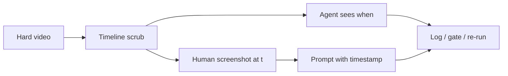
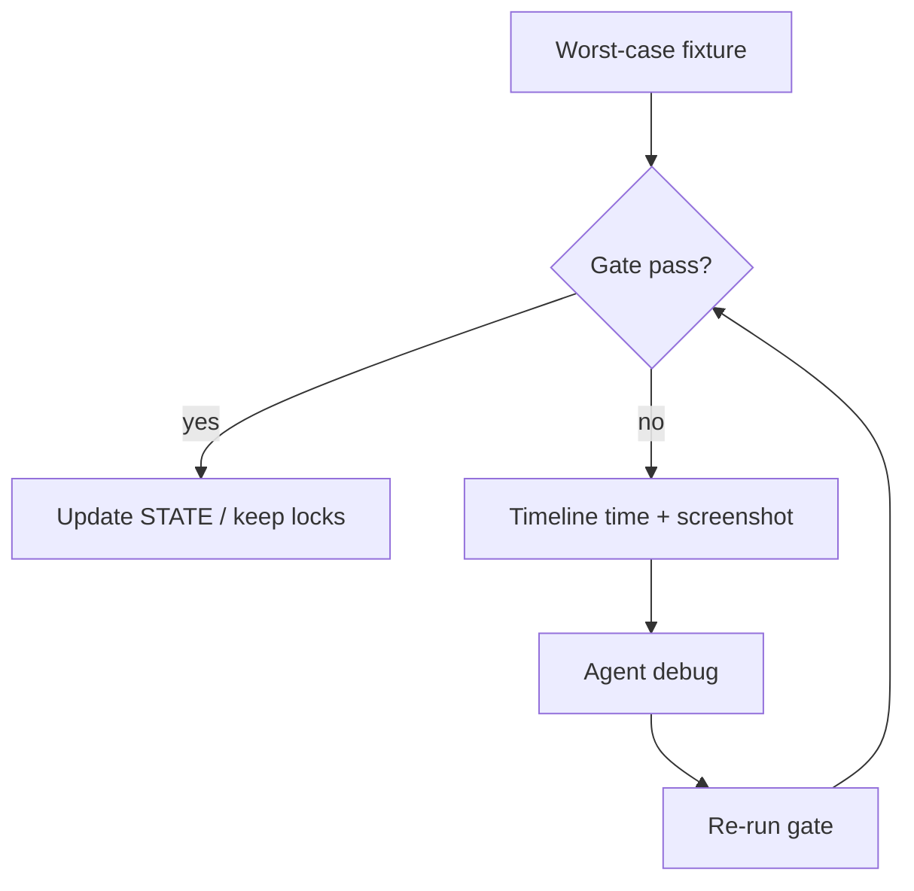

Week one answered a hard question: **can we tell pass from fail** without me babysitting every prompt?

Week two answered the next one: **can we tell *when* and *why* — still without me glued to the desk?**

Safe Faces is the on-device face blur app I’m shipping so parents can post without handing kids’ faces to scrapers. Same series. Same road to live and the first 100 users. Same rule:

> Post the memory. Not their face.

I filmed a shorter surface update this week (last week’s ~30 minutes was too long). This post is the deep dive — process, thought process, and the decisions I’d make the same way on a team.

---

## Quick recap

**What shipped**
- A **timeline** in the editor — scrub duration, see where blur lives over time
- Agent-facing accuracy: failures can be tied to a **specific time**, not a vague “something failed”
- Clearer report reading: coverage, duration, failures, ghosts, ground truth, jitter, frames, pass/fail
- Worst-case fixture mindset + screenshot → timestamp → prompt when the gate is blind
- Product tools entering the test surface (draw-to-blur, cover styles, size, intensity)

**Still true**
- Hard classroom/party clips fail first — that’s intentional
- Ghosts on body/legs during fast pans are still a real enemy
- Logs without time waste tokens; time without judgment still needs human eyes sometimes

Week 1 built the bouncer. Week 2 gave failures an address.

---

## Where week 1 left me

I work a nine-to-five. I can’t sit in Cursor asking “did this work?” every two minutes.

So last week I built a QA **gate**: fixtures in, real pipeline out, pass or fail. Logs. Scoreboards. `STATE.md` so agents resume instead of reinventing the wheel.

That worked — until it didn’t.

A gate that says *false* without telling you **where** in a three-minute pan the jeans blur appeared still leaves someone (me or the agent) scrubbing by hand. And when agents don’t have a timestamp, they guess. Guessing burns tokens. Guessing also burns architecture — random “try something new” passes that don’t stick.

Week two’s thought process was simple:

> If I can’t be at the computer, the system needs better *evidence*, not more vibes.

---

## The gap: logs without time

I had plenty of logs. Constant reports. That’s good — it stops the model from hallucinating the same “fix” forever.

But specificity was missing.

“Something failed across fixtures” is not the same as “at 0:42 on this hard pan, coverage dropped / a ghost sat on a thigh.”

Agents aren’t mind readers. They’re pattern matchers with a context window. If your context is mushy, your fixes are mushy.

So I needed a clock.

---

## The week 2 fix: a timeline (product + agent tool)

I added a **timeline** to the app experience.

Last week the flow felt closer to: upload → analyze → track. This week you can see duration, scrub, and reason about the clip the way an editor would — because parents will need that too.

That dual purpose mattered on purpose:

1. **UX** — I was going to ship a timeline for users anyway. Scrubbing, reviewing covers, cutting. No better time than now.
2. **QA** — the same surface gives agents (and me) a place to pin *when* an error shows up, then log it and gate against it.

I didn’t build a throwaway debug widget. I built the real control surface early so the reliability loop and the product don’t diverge.

**Hire-signal framing:** good engineering often looks like collapsing two problems into one artifact. Here the artifact is time.

*Failures without a timestamp are rumors. Failures with a timestamp are tickets.*

---

## How I read a report when I come back from work

When I’m not watching the full gate run (it’s long — I’m not going to film the whole wait), I come back to a report. Week two was about reading that report like a product owner, not like a vanity dashboard.

Here’s what I care about and **why**:

| Signal | What I’m protecting | Thought process |
|--------|---------------------|-----------------|
| **Blur boxes checked** (hundreds across fixtures) | Scale | One lucky clip isn’t a product. The corpus is. |
| **Coverage ratio (~1)** | Kids’ faces stay covered | Below that ballpark means leak risk. I don’t want “mostly.” |
| **Duration / when covered** | Coverage over *time* | Detected once at frame 0 doesn’t help at 0:47. |
| **Failures** (e.g. uncovered detections) | Concrete miss counts | Agents can chase numbers. I can’t babysit every miss by eye. |
| **Ghost boxes** | No floating random squares | Zero ghosts is a real win — polished feel, parent trust. |
| **Ground truth** | Blur on faces, not jeans/legs/body | Fast pans still slide boxes onto clothing. That’s unpolished. That’s a ship-blocker vibe. |
| **Jitter score** | Export still *feels* like their video | Parents shouldn’t feel “AI chewed this.” Same quality in, same quality out — with covers. |
| **Total frames** | Tracking at corpus scale | Ballpark range across fixtures; catch silent miss streaks. |
| **Pass / fail** | Binary go/no-go | `false` isn’t shame — it’s the start of the agent’s job. |

Example mindset from this week: a report can show ghost boxes at zero (great) and still fail on uncovered detections. Celebrate the win. Don’t pretend the fail isn’t there. Then let the agent debug and re-run until it’s green — or until the evidence says we need a different approach.

**Coverage alone still lies** if ghosts look like “coverage.” That’s why ghosts and ground truth stay first-class. Week 1 taught that. Week 2 operationalized it with time.

---

## Process when a run fails

Hard clip. Worst-case first. Gate says false. Cool.

What I do **not** do: sit there emotionally negotiating with the scoreboard.

What I do:

1. **Read the report** — which signal failed? ghosts? GT? coverage? jitter?
2. **If I’m reviewing live** — scrub the timeline, screenshot the ugly frame
3. **Prompt with evidence** — screenshot + approximate/exact time on the timeline
4. **Let the agent debug** against code + fixtures (MCP / harness), not against my memory
5. **Re-run** — another pass until the gate agrees or we revert a bad idea
6. **Log** — so next session doesn’t burn tokens rediscovering the same dead end

Failing first on a brutal classroom/party-style clip is intentional. If that passes, easier uploads should follow. If you only test the friendly demo, you ship a demo.

*The loop is the product discipline. The timeline made the loop cheaper and more accurate.*

---

## Worst-case fixtures + screenshots (why both)

Agents and gates are powerful. They’re not omniscient.

Sometimes the gate doesn’t log what my eyes catch. Sometimes the model “thinks” it fixed a float and the jeans square is still there at 0:19. When I’m present to review, I screenshot. Then I put that screenshot in the prompt **with the timeline time**.

Thought process:

- **Worst-case first** — design for the parent filming a whole classroom or birthday chaos: motion, pan, occlusion, stuff in the way. Anticipate reality.
- **Screenshots + timestamps** — human judgment becomes structured evidence, not a rant in the chat.
- **Don’t burn tokens on random retries** — “try something new” with no address is how you waste money and thrash working code.

Week 2 in one sentence for collaborators: **I don’t need more AI. I need better evidence for the AI I already use.**

---

## Product tools entering the test surface

The timeline isn’t only for QA. Users will scrub, cut, and decide what stays covered.

Same week I called out tools that parents will actually touch:

- Draw a region to blur  
- Cover styles (emoji, frosted, etc.)  
- Size and intensity  

Thought process: if QA only ever tests default auto-blur, the report will green-light a product people don’t use. As soon as styles and manual regions matter in the UX, they have to matter in the fixtures and the gate.

That’s how you keep “polished” from meaning “works in the lab.”

---

## Trust: beta feedback ≠ keeping your media

I’m pushing TestFlight. Feedback helps — crashes, screenshots, “this moment broke.”

Important clarification I said out loud and I’m putting in writing:

Safe Faces is not quietly holding onto people’s photos and videos. On-device processing stays the thesis. Beta feedback is about **what broke and when** — the same timestamp mindset — not harvesting training data off families.

Privacy products die when the marketing says protect kids and the pipeline says upload everything. I’m not doing that.

---

## Format choice (why this post exists)

Last week’s long video taught me something about attention: surface updates on camera, depth on the blog.

- **Video** — what changed, show the timeline, show the report, keep it watchable  
- **Blog** — technical workflow, tradeoffs, hire-friendly depth  

If you’re following the series for the product, watch the update. If you’re following for how I build with agents under real constraints, this is the piece.

---

## Wins vs still open

### Wins
- Timeline as shared language between UX and agents  
- Failures can carry a **when**, not just a vibe  
- Clearer mental model for reading reports after work  
- Worst-case-first testing + screenshot evidence loop  
- Shorter video format; depth lives here  

### Still open / ongoing
- Body/leg blur on fast pans (ground-truth pain)  
- Making every human-caught ghost automatically visible to the gate  
- Folding styles/manual tools deeper into automated testing  
- Keep failing honest runs until hard fixtures go green without lowering the bar  

Week three will keep that pressure on. Same rule as week one: **never weaken the grader to feel done.**

---

## Takeaways

- A gate without timestamps trains agents to guess  
- Collapse UX and QA into one artifact when you can (timeline)  
- Read metrics as values you’re protecting, not as dashboard candy  
- Worst-case fixtures first; easy clips will follow  
- Screenshots + time = evidence; random retries = token waste  
- On-device privacy includes how you handle beta feedback  

---

## Closing

Week two wasn’t a prettier demo. It was making the QA loop honest enough that I don’t have to sit at the desk to know when blur failed.

What I’m holding to:

- Improve the **system**, not just the clip that already looks good  
- Treat agents like juniors with CI — evidence in, thrash out  
- Design for the parent’s hardest upload, not the friendly reel  
- Say what still fails, with a plan that doesn’t lower the bar  

Week 1: can we tell pass from fail?  
Week 2: can we tell **when** and **why** — without me babysitting?

I'll add the YouTube update here as soon as it's up. Previous deep dive: [Safe Faces Week 1](/blog/safe-faces-week-1). Beta: [TestFlight](https://testflight.apple.com/join/Uv7xJrkp) · site: [safefaces.xyz](https://www.safefaces.xyz/).

See you in week three.
